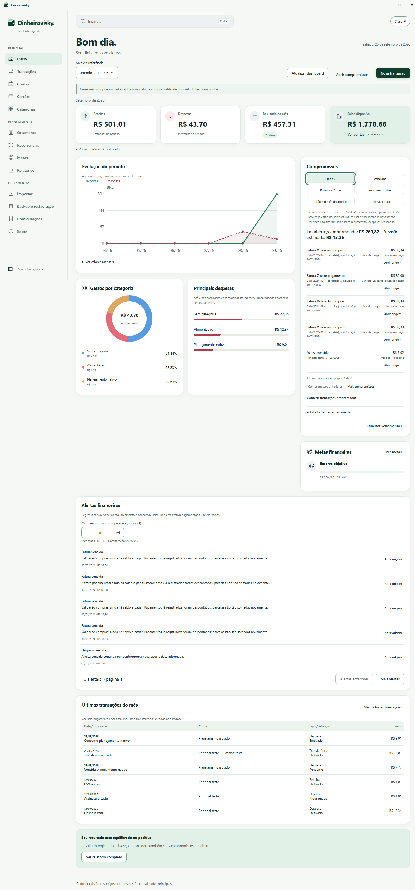

<p align="center"></p>

# Dinheirovisky.

**Seu bolso agradece.** Gerenciador de finanças pessoais para desktop, com dados locais e funcionamento offline, sem login.

[Site oficial](https://dinheirovisky.app/) · [Releases](https://github.com/DanielLinsAndrade/dinheirovisky/releases) · [Changelog](CHANGELOG.md)

## Estado do projeto

A versão **1.0.0** está preparada para a primeira release oficial, mantida como draft até aprovação final. O instalador só ficará disponível publicamente após a publicação da release. Windows x64 é a plataforma validada; outros sistemas ainda não foram homologados.

## O que você pode fazer

- Organizar contas, categorias, receitas, despesas e transferências.
- Acompanhar cartões, compras parceladas, faturas, pagamentos e estornos.
- Consultar dashboard, relatórios, análises de consumo e fluxo de caixa.
- Planejar orçamento, recorrências, compromissos e metas financeiras.
- Buscar registros e adicionar metadados e anexos, com visualização local de imagens e PDF.
- Importar CSV e OFX com prévia, validação e detecção de possíveis duplicatas.
- Criar backups e restaurá-los com validação e confirmação.
- Escolher temas claro, escuro ou do sistema e preferências de moeda, datas e período financeiro.



*Captura real do aplicativo com dados fictícios gerados pela suíte de testes. Nenhum dado financeiro pessoal é usado nesta imagem.*

## Instalação

Quando a primeira versão estiver publicada, baixe o instalador Windows x64 (`.exe`) na página de [Releases](https://github.com/DanielLinsAndrade/dinheirovisky/releases), confira o SHA-256 informado e execute-o. O aplicativo usa o Microsoft Edge WebView2 Runtime; a instalação desse pré-requisito pode precisar de internet. O uso normal do aplicativo funciona offline.

Os builds atuais não têm assinatura digital de código. O Windows pode exibir um aviso de editor desconhecido/SmartScreen. Verifique a origem e o hash do download antes de decidir executá-lo.

## Privacidade e dados

Não há autenticação, sincronização em nuvem ou conexão automática com bancos. As consultas, gravações, relatórios e visualizações de anexos são locais. Não é necessário enviar seu banco para usar o aplicativo.

No Windows, os dados do produto ficam em `%LOCALAPPDATA%\com.dinheirovisk.desktop`. O SQLite e os backups **não são criptografados pelo aplicativo**: proteja sua conta do sistema e o local onde guarda as cópias. Mantenha backups em local seguro. Não inclua bancos, comprovantes ou arquivos importados em issues ou contribuições públicas.

## Desenvolvimento local

Pré-requisitos: Windows x64, Node.js **22.16 ou superior** (incluindo os testes SQLite), npm, Rust estável com toolchain MSVC, Microsoft C++ Build Tools/Windows SDK e WebView2 Runtime. Veja os [pré-requisitos oficiais do Tauri](https://v2.tauri.app/start/prerequisites/).

Na raiz do projeto, em PowerShell:

```powershell
npm ci
$env:Path = "$env:USERPROFILE\.cargo\bin;$env:Path"
npm run tauri dev
```

Esse comando abre o aplicativo desktop com a identidade normal e pode acessar seus dados existentes. Para validar sem usar dados pessoais, utilize a suíte nativa isolada descrita abaixo. `npm run dev` abre somente o frontend; os recursos financeiros precisam do backend Tauri.

## Build e testes

```powershell
npm run typecheck
npm run lint
npm run format:check
npm test
npm run test:rust
cargo fmt --manifest-path src-tauri/Cargo.toml --check
cargo clippy --manifest-path src-tauri/Cargo.toml --locked --all-targets -- -D warnings
npm run build:release
```

O build executa também a compilação do frontend. O instalador NSIS fica em `src-tauri/target/release/bundle/nsis/`; o executável fica em `src-tauri/target/release/dinheirovisk.exe`. O nome interno histórico foi mantido para preservar compatibilidade.

A validação completa, incluindo instalação e teste desktop com dados sintéticos, é:

```powershell
npm run validate
```

Ela requer uma sessão Windows desktop desbloqueada e usa uma identidade de aplicativo separada. Não rode suítes nativas simultaneamente. Consulte [tests/README.md](tests/README.md) para isolamento, cobertura, limites e artefatos.

## Estrutura

- `src/`: interface React/TypeScript, componentes, funcionalidades e testes.
- `src-tauri/src/`: comandos Tauri, domínio financeiro e persistência Rust/SQLite.
- `src-tauri/migrations/`: migrações versionadas do banco.
- `public/`: identidade visual e avisos de licenças redistribuídos.
- `tests/`: validação integrada e automação nativa Windows.
- `docs/`: documentação pública e preparação de release.

Valores monetários são tratados em unidades inteiras; as regras financeiras e gravações ficam no backend. O frontend acessa o banco por comandos Tauri. Veja também [anexos e backup](docs/anexos-backup-v2.md).

## Licença

MIT License — Copyright (c) 2026 Daniel Lins Andrade. Consulte [LICENSE](LICENSE). Componentes de terceiros mantêm suas próprias licenças; veja [avisos de terceiros](docs/THIRD_PARTY_NOTICES.md).
